# springcloud
## 简介
springcloud + oauth2 + nginx + 前后端分离，网关API、API-doc，服务令牌颁发、登录鉴权,服务调用鉴权处理等；

## 分支信息
分支信息 | 内容
----|----
feature | access_token鉴权方式
develop | jwt_token鉴权方式 

## 项目结构
    
``` lua
spring-cloud-demo
├── config-repo -- springcloud-config 配置项git仓库
├── prepare -- 运行前准备
|    ├── html -- 前端资源
|    ├── nginx-config -- nginx配置
|    └── sql -- sql脚本
├── spring-cloud-api-gateway -- API网关[端口:5555]
├── spring-cloud-common -- 通用工具模块
├── spring-cloud-config -- 配置中心[端口:20000]
├── spring-cloud-database-generator -- tkmybatis通用mapper自动代码生成工具
├── spring-cloud-domain -- 实体对象模块
├── spring-cloud-eureka -- 服务注册中心
├── spring-cloud-oauth2 -- 令牌颁发、鉴权中心
├── spring-cloud-service-A -- microService[端口:11000] 
|    ├── com.cloud.demo.client -- 跨微服务调用接口
|    ├── com.cloud.demo.config -- 资源服务器、文档配置、feign拦截器
|    ├── com.cloud.demo.controller -- controller层
|    ├── com.cloud.demo.dao -- 通用mapper，dao层
|    ├── com.cloud.demo.hystrix -- 服务熔断配置
|    └── com.cloud.demo.service -- service层
├── spring-cloud-service-B -- microService[端口:12000] 
|    ├── com.cloud.demo.config -- 资源服务器、文档配置
|    ├── com.cloud.demo.controller -- controller层
|    ├── com.cloud.demo.dao -- 通用mapper，dao层
|    └── com.cloud.demo.service -- service层
└── spring-cloud-service-user -- microService[端口:13000] 
     ├── com.cloud.demo.config -- 资源服务器、文档配置
     ├── com.cloud.demo.controller -- 登录、用户controller层
     ├── com.cloud.demo.dao -- 通用mapper，dao层 
     └── com.cloud.demo.service -- service层
```

## 技术选型
### 后端技术
技术 | 名称 | 官网
----|------|----
SpringBoot | 服务端框架  | 
spring-cloud-starter-zuul | API网关  | 
spring-cloud-starter-oauth2 | 令牌颁发、鉴权 | 
spring-cloud-config-server | 配置中心  |
spring-cloud-starter-eureka-server | 服务注册中心  |
spring-cloud-starter-feign | 服务调用  |
spring-cloud-starter-hystrix | 熔断  |
mysql | 关系型数据库  | 
Redis | 分布式缓存数据库  | 
tkMyBatis | 通用ORM框架  | 
tkMyBatis Generator | 通用Mapper代码生成  | 
PageHelper | 分页插件  | 
Druid | 数据库连接池  | 
Swagger2 | 接口测试框架  | 
Log4J2 | 日志组件  |
Maven | 构建管理  |
nginx | 反向代理服务  | 

### 前端技术:
技术 | 名称 | 官网
----|------|----
bootstrap | UI框架  | 
jquery | js类库  | 

## 环境准备：
- Jdk8+ 
- Mysql5.6+
- Redis
- nginx
- maven
- postman

## 准备工作：
1. 修改本地hosts文件，添加本地域名（可自定义域名）
    ```
    127.0.0.1	www.lly824.com
    ```
2. 配置nginx,添加静态资源地址，地址指向/prepare/html/bootstrap文件夹，启动nginx，浏览器访问如下地址：
 [http://www.lly824.com:8080/springcloud/login.html](http://www.lly824.com:8080/springcloud/login.html)
，如果正常访问，说明配置正确;

3. 启动redis，用于oauth2存储token令牌存储器，如果redis不是默认端口，修改spring-cloud-oauth2下的redis配置端口号;

4. 启动mysql，执行/prepare/sql下的文件，并修改spring-cloud-oauth2、spring-cloud-service-A、spring-cloud-service-B、
spring-cloud-service-user模块的数据库连接用户名密码;

5. 启动springcloud，启动顺序：
    - spring-cloud-eureka
    - spring-cloud-config
    - spring-cloud-api-gateway
    - spring-cloud-oauth2
    - spring-cloud-service-B
    - spring-cloud-service-A
    - spring-cloud-service-user

## 演示

### eureka服务注册状态
登录http://localhost:10001/ ，查看eureka服务注册状态：<br/>
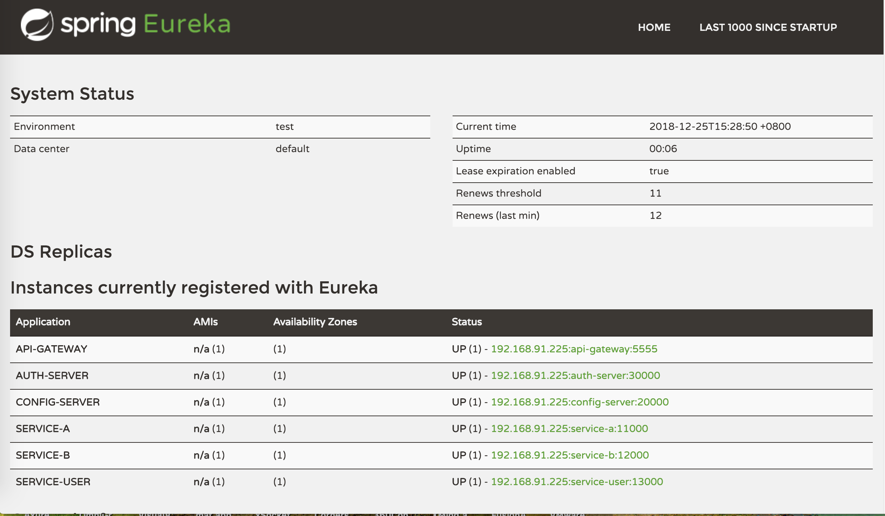

### API DOC
登录http://localhost:5555/swagger-ui.html#/ ，可查看所有微服务的api doc：<br/>
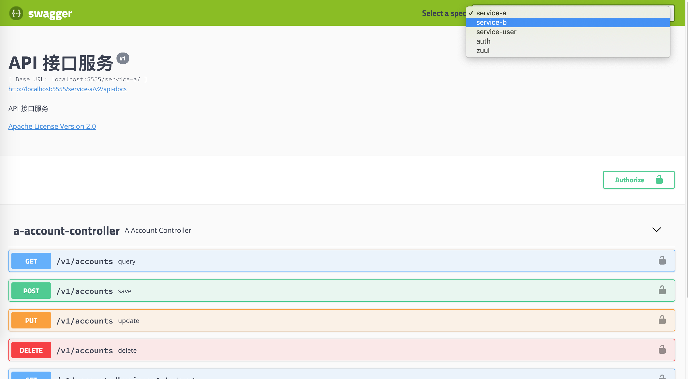

点开一个接口文档，点击右上角的Try it out，输入请求入参，点击Execute执行按钮，
可以看到401未经授权：访问由于凭据无效被拒绝的错误<br/>
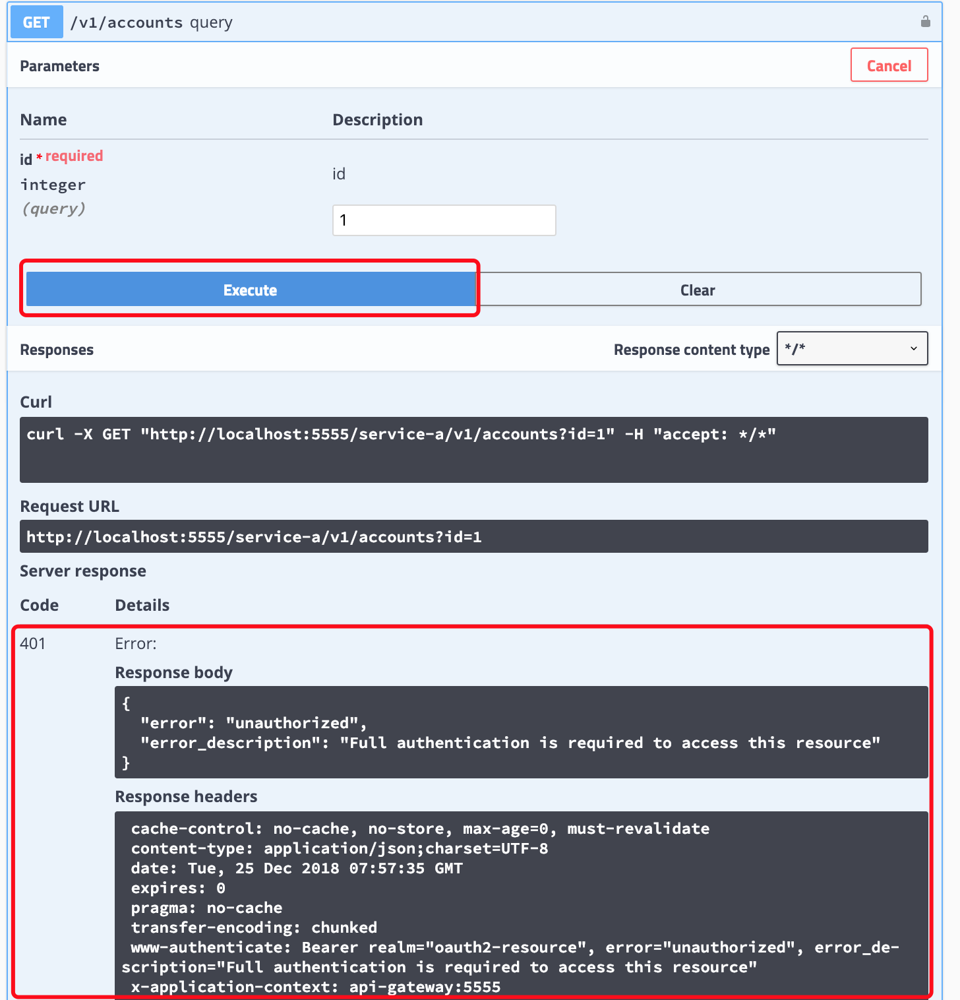

#### API 授权
点击右上角的Authorize的按钮（带锁图标）,弹出API授权页面，选择oauth2授权，
输入存储在mysql的用户名和密码信息、鉴权服务器中存储的客户端认证信息，
点击Authorize按钮完成认证。<br/>
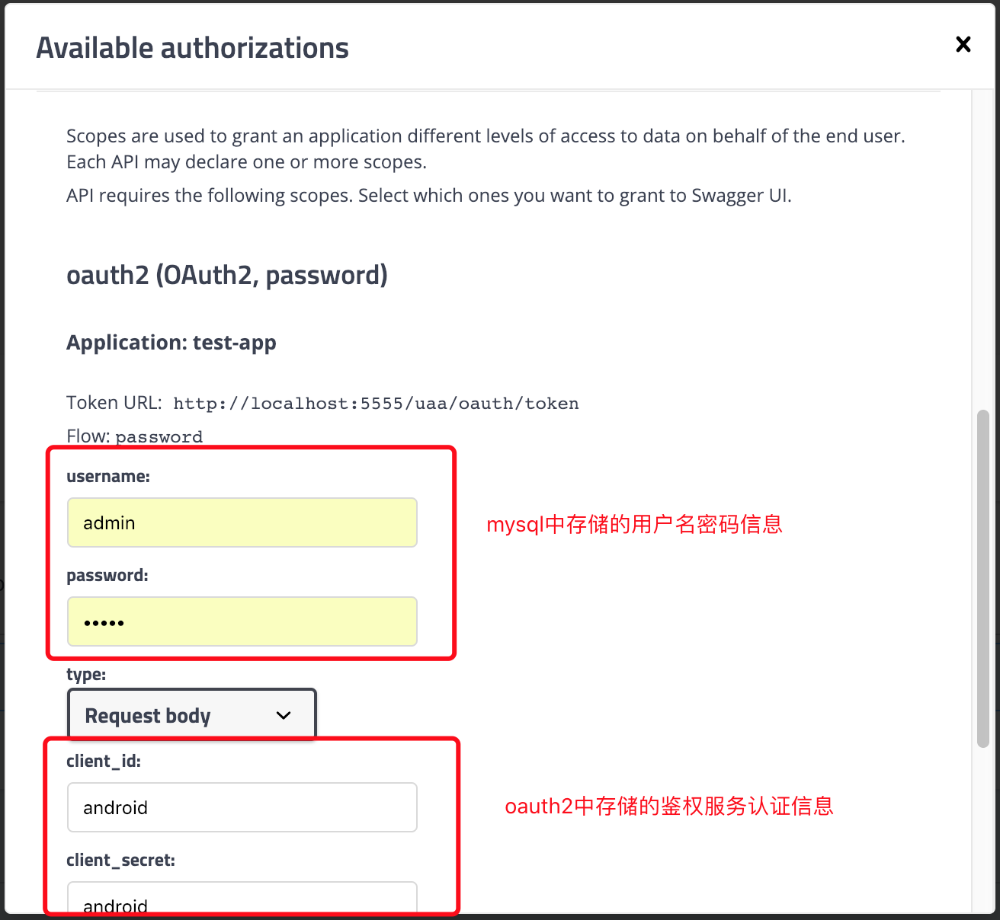

认证成功后,右上角会有锁定的标志，重新测试api的接口，可观察到请求的header头中已经添加了Bearer token信息，
接口已经可正常的返回相关信息：<br/>
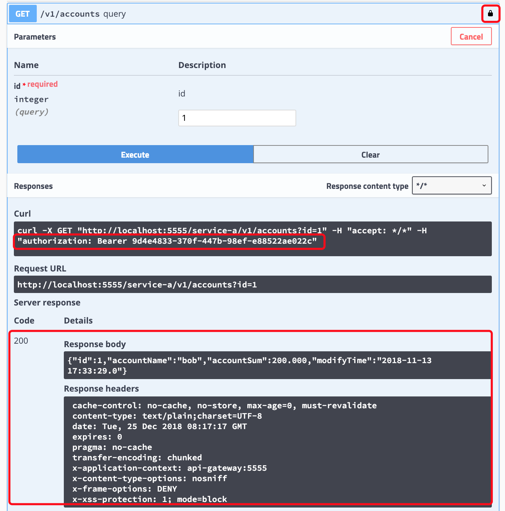

### 服务调用
该springcloud项目下所有的微服务都需要经过API网关进行请求转发、oauth2进行资源服务鉴权。
1. oauth2鉴权，打开postman，选择POST方式，访问http://localhost:5555/uaa/oauth/token?grant_type=password，
输入用户名密码、客户端认证信息、head信息（Content-Type：application/x-www-form-urlencoded，Accept：application/json）,
点击send，可观察到返回的信息中带有token信息: <br/>
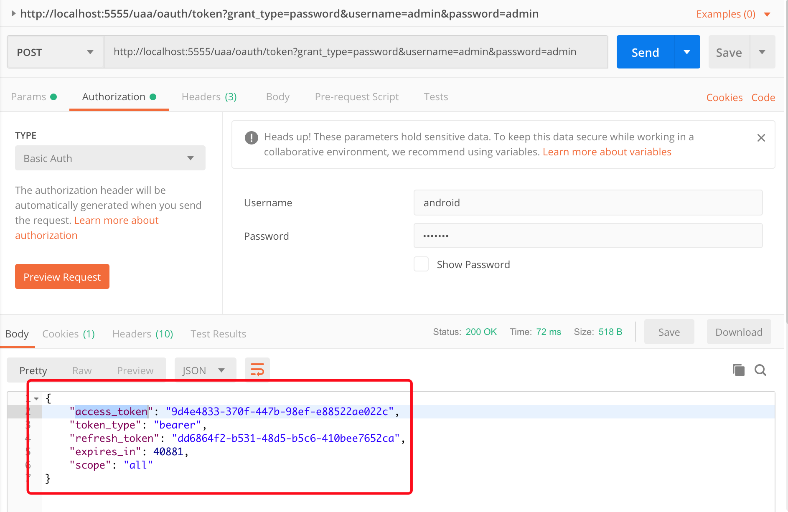

2. 通过网关访问微服务，有两种token传输方式，第一种直接在url中添加access_token参数，第二种通过http head添加Bearer token信息，
如果只有一层调用（没有服务间调用），无需额外处理，即可调用资源服务： <br/>
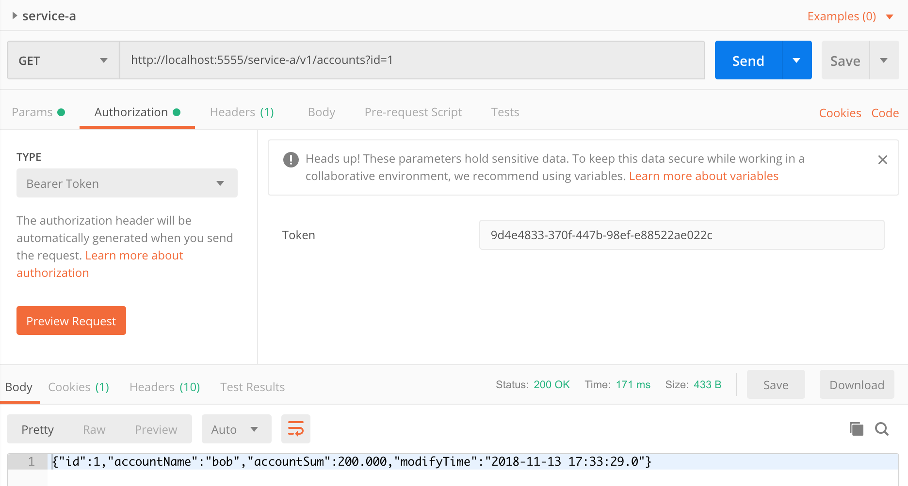

3. springcloud微服务之间调用方式有两种，第一种ribbon，通过rest调用；
第二种feign,包含ribbon,通过接口调用（类似本地调用）；feign服务调用默认不会传递header头信息，
需要额外处理（详见FeignBasicAuthRequestInterceptor.java）： <br/>
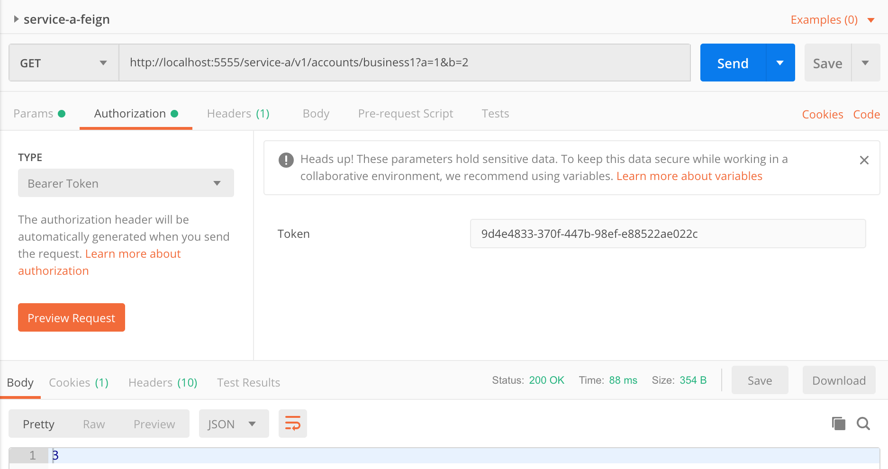

### 前后端分离登录演示
1. 浏览器输入： [http://www.lly824.com:8080/springcloud/login.html](http://www.lly824.com:8080/springcloud/login.html) ，
进入登录页，输入用户名密码信息， <br/>
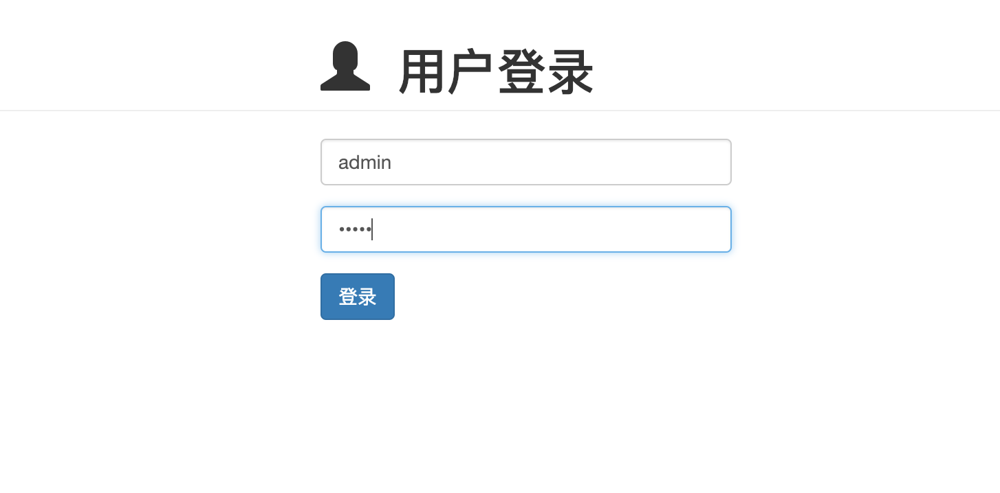

登录成功后会返回token信息（详见LoginController.java）: <br/>
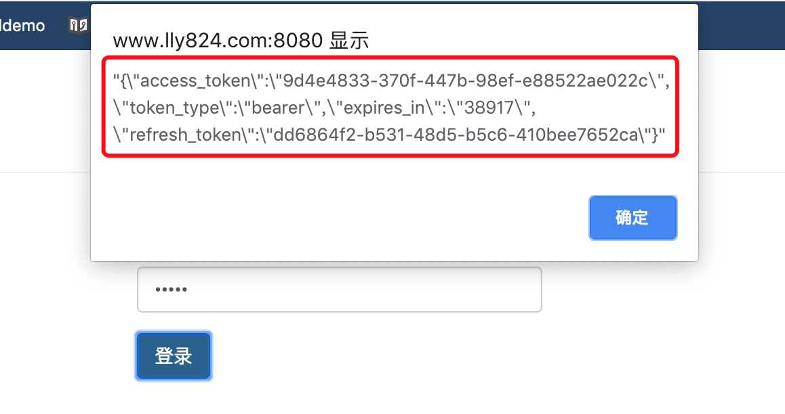

点击确定跳转至其他页面，此时客户端已经保存了对应的token信息，此时访问其他资源时，带上对应的header头信息，
可正常访问所需的资源服务：<br/>
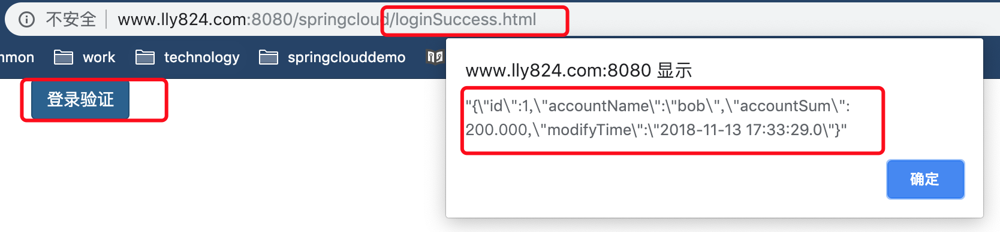

### JWT token
将工程切换至develop分支，按顺序启用各个微服务组件，此时鉴权时可观察到token信息如下，

jwt token中可携带自定义的信息，如用户基本信息、权限信息等，


